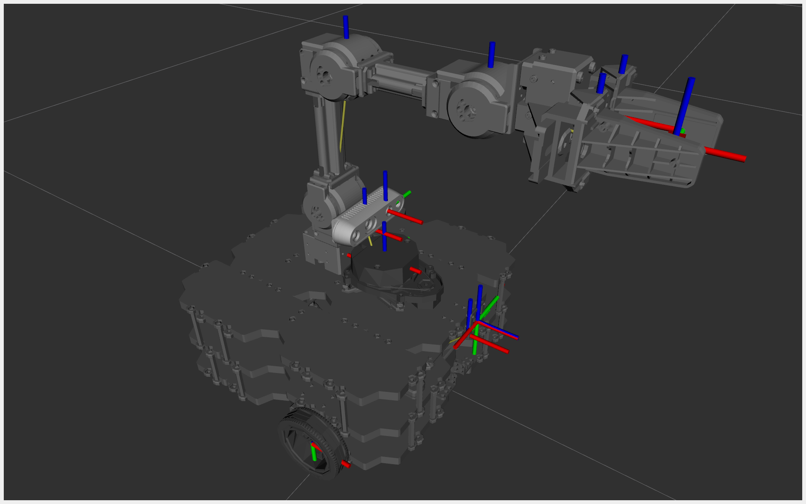
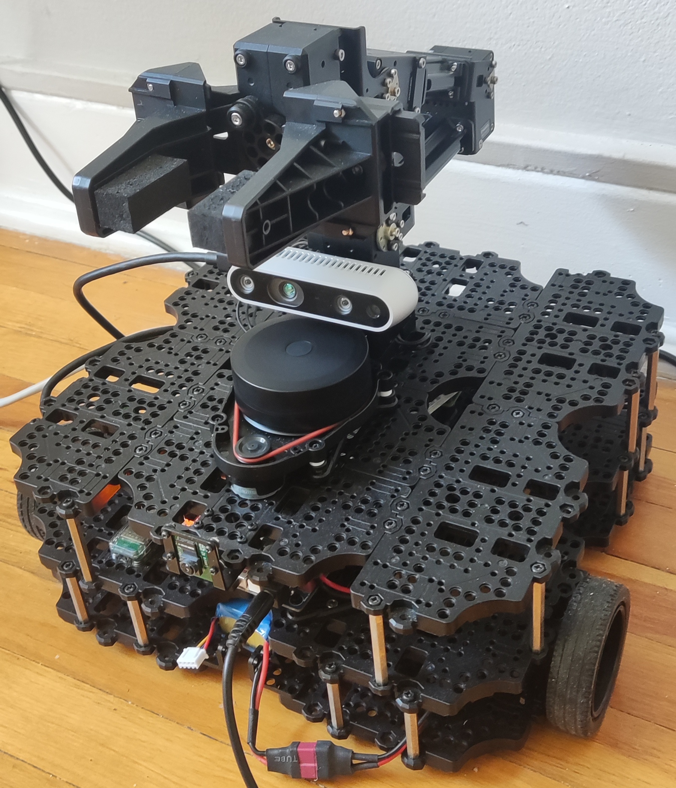
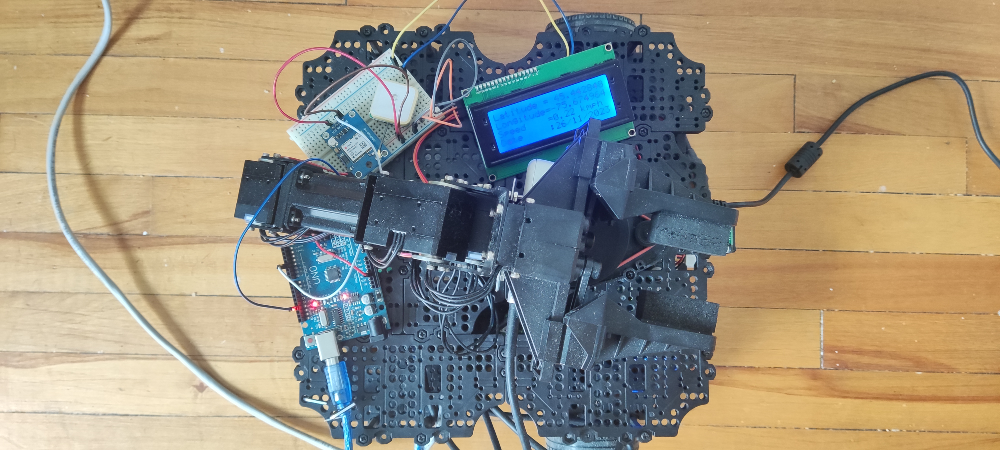
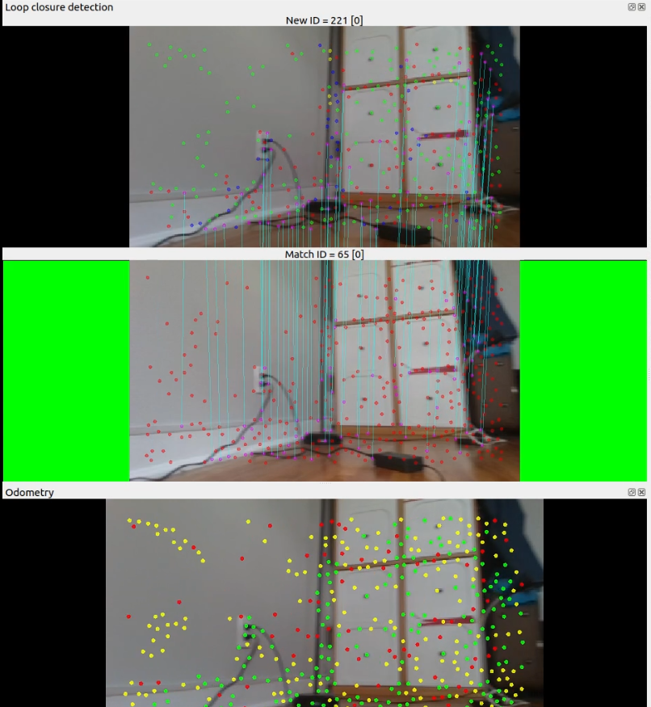
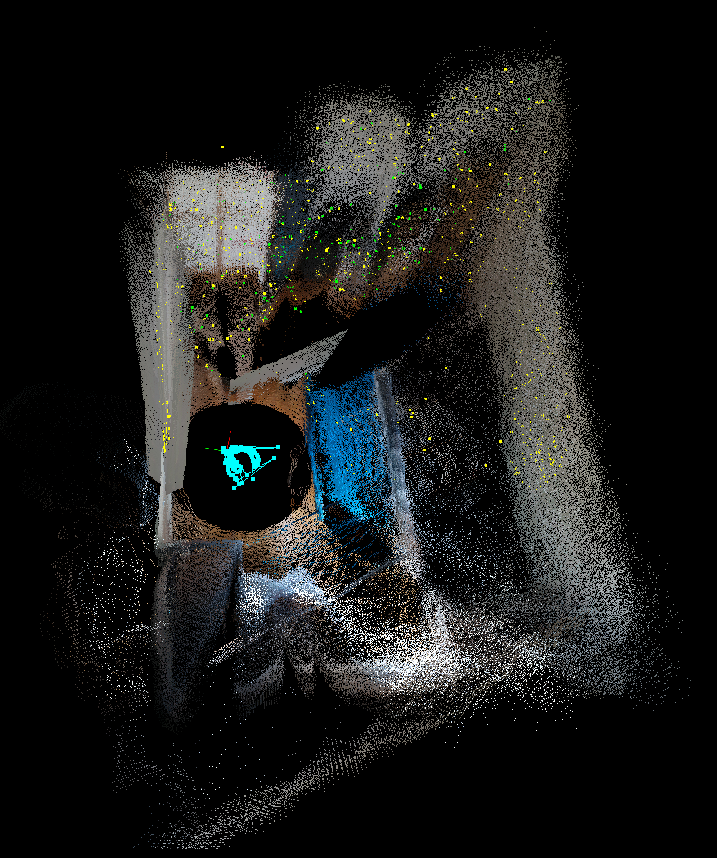
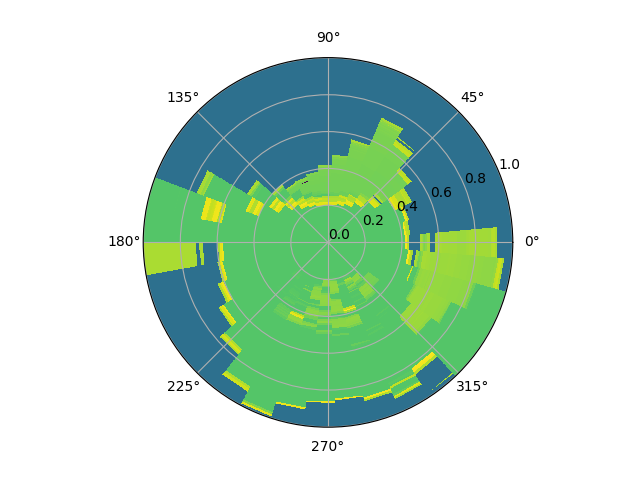
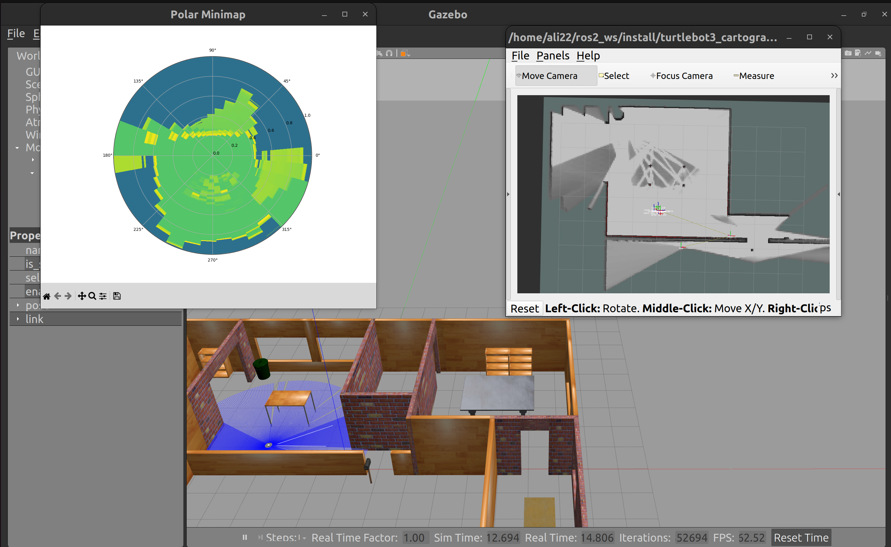
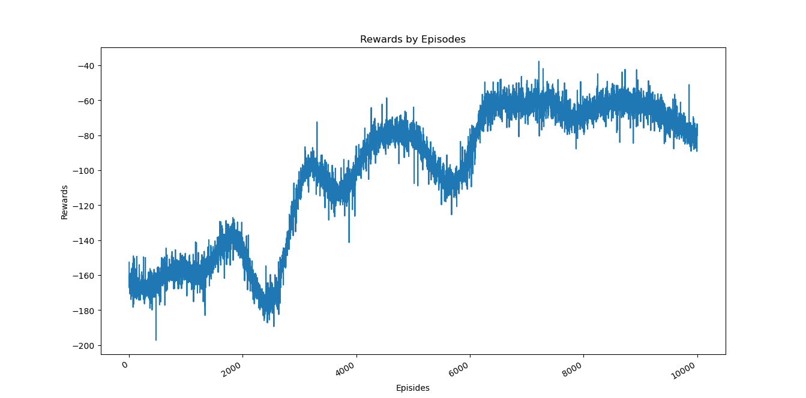

# Autonomous Navigation and Environmental Mapping with TurtleBot3
## Using Reinforcement Learning and VSLAM

### Overview
This project delves into the integration of Reinforcement Learning (RL) with Visual Simultaneous Localization and Mapping (VSLAM) to augment the autonomous navigation and mapping capabilities of the TurtleBot3 platform. Employing the advanced Twin Delayed Deep Deterministic Policy Gradient (TD3) algorithm alongside the RealSense D435i camera for VSLAM, the study aims to deliver precise and dynamic mapping and navigation in diverse environments.

### Technologies Used
- **Robot Operating System (ROS)** for overarching robot management and processes.
- **Gazebo** for simulating the robot in intricate, controlled environments.
- **RTAB-Map** for implementing VSLAM that facilitates real-time localization and mapping.
- **Intel RealSense D435i** camera that provides rich depth data for 3D environment perception.
- **GPS Module** for outdoor navigational capabilities extending the functional scope of the robotic system.

### Objectives
- To enhance autonomous pathfinding capabilities through the integration of RL.
- To achieve high-precision mapping using VSLAM in varied environments.
- To explore the synergy between RL algorithms and VSLAM in improving autonomous navigational tasks.

### Methodology
1. **Reinforcement Learning Implementation:**
   - Utilize the TD3 algorithm, a variant of Deep Deterministic Policy Gradient (DDPG), known for reducing the overestimation of Q-values and improving policy learning stability.
   - Train the model in simulated environments using Gazebo to handle real-world unpredictabilities effectively.
   
2. **Visual SLAM Integration:**
   - Implement RTAB-Map as the core for VSLAM to construct a real-time updatable 3D map of the environment.
   - Combine depth sensing from the Intel RealSense camera with traditional SLAM methodologies for enhanced spatial awareness.

3. **GPS Enhancement:**
   - Integrate GPS data for outdoor navigation, ensuring global positioning and extended operational domains beyond typical indoor environments.

### Results and Discussion
- **Navigation Accuracy:**
  - The combination of TD3 and VSLAM resulted in superior navigational accuracy, with the robot capable of dynamically adjusting its trajectory based on real-time environmental feedback.
- **Mapping Precision:**
  - Demonstrated the capability to generate detailed and accurate 3D maps of the environment, which are crucial for various practical applications.
- **Learning Efficiency:**
  - Analyzed the efficiency of the TD3 algorithm in learning optimal paths and navigating strategies under different scenarios.

### Visualizations
1. **TurtleBot3 Setup with Camera Integration**
  

2. **Complete Robot Setup with All Components**
  

3. **GPS Integration**
   

4. **Loop Closure Detection in VSLAM:**
   

5. **3D Environmental Maps:**
   

6. **Polar Radar Visualization**
  This visualization shows the data captured by the robot's sensors in real-time. This data is crucial for the robot's RL algorithm, which uses it to make intelligent decisions and navigate the environment safely.
  

7. **Training Process Visualization**
  

8. **TD3 Learning Curves:**
   The following chart depicts the training process of the RL model, showing the progression of learning and the improvement in rewards over time.
   

### Conclusions and Future Directions
The project underscores the significant potential of integrating RL with VSLAM for enhancing autonomous robotic navigation. Future research will focus on refining these algorithms, exploring their scalability across different robotic platforms, and extending their applicability to more complex and unstructured environments.
